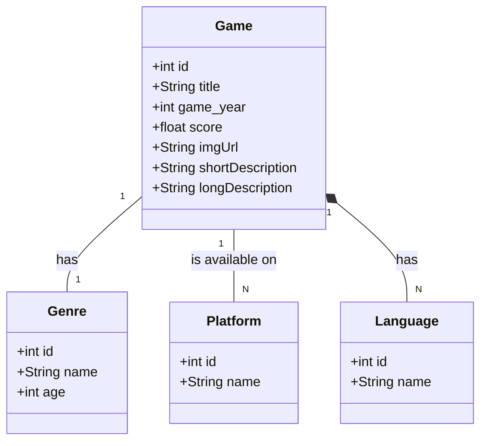

# DIO-API-Game
Projeto Publicando Sua API REST na Nuvem Usando Spring Boot 3, Java 17 e Railway

## Diagrama de classes

## Acessos

URL Padrão
- http://localhost:8080/games	
	
Doc API	
- http://localhost:8080/swagger-ui/index.html

H2 Database
- http://localhost:8080/h2-console/	